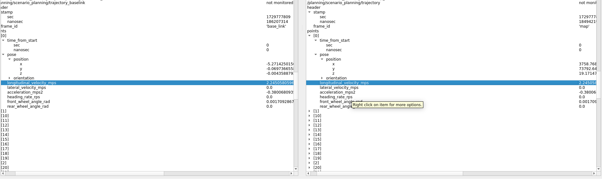
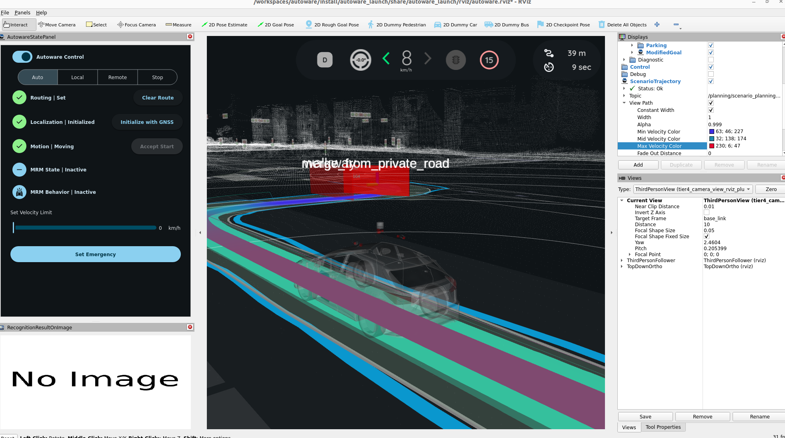
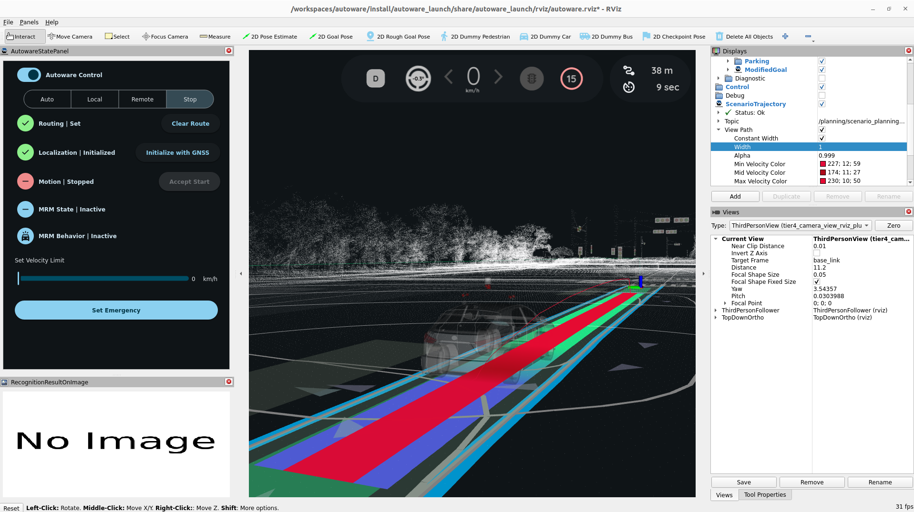
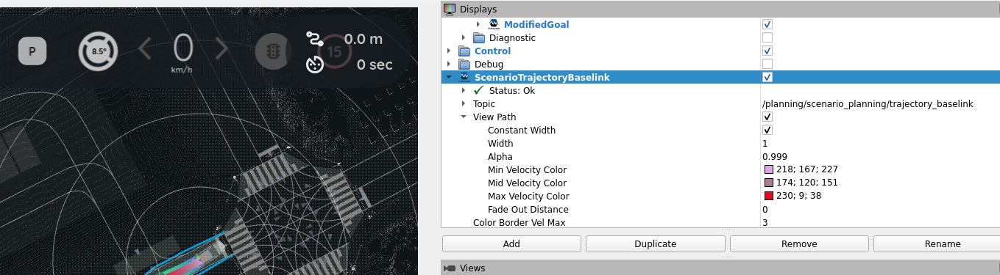

# Planning Validator Trajectory Transformer

The `autoware_planning_validator` is a module that checks the validity of a trajectory before it is published. The status of the validation can be viewed in the `/diagnostics` and `/validation_status` topics. When an invalid trajectory is detected, the `autoware_planning_validator` will process the trajectory following the selected option: "0. publish the trajectory as it is", "1. stop publishing the trajectory", "2. publish the last validated trajectory".

## Author Disclaimer
This is the Autowarefoundation ros2 humble package.
I have simply added the functionality to transform the autoware trajectory message.
This added functionality is free to use at own risk.

Created by: Robert Watkins
Creation Date: 22/10/2024

## Supported features

The following features are supported for trajectory validation and can have thresholds set by parameters:

- **Trajectory Transformer** : e.g. Inf, Nan

The following features are to be implemented.

- **(TODO) Refactor the trajectory transformer.cpp into the utils or remove it** : Either remove the trajectory_msg_transformer or combine it with the util's program.

## Inputs/Outputs

### Inputs

The `autoware_planning_validator:: Tracjectory Transformer` takes in the following inputs:

| Name                 | Type                              | Description                                    |
| -------------------- | --------------------------------- | ---------------------------------------------- |
| `~/output/trajectory` | autoware_planning_msgs/Trajectory | target trajectory to be validated in this node |

### Outputs

It outputs the following:

| Name                          | Type                                       | Description                                                               |
| ----------------------------  | ------------------------------------------ | -----------------------------------------------------------------------  |
| `~/output/trajectory_baselink`| autoware_planning_msgs/Trajectory          | validated Trajectory                                                     |

## Parameters

The following parameters can be set for the `autoware_planning_validator:: Tracjectory Transformer Node`:

### Trajectory_msg_Transformer Node: Standalone parameters

| Name                               | Type | Description                                                                               | Default value |
| :--------------------------------- | :----- |---------------------------------------------------------------------------------------- | :------------ |
| `output_trajectory`                | String | Select the topic for the input trajectory                                               | NA            |
| `output_trajectory_baselink`       | String | Select the topic for the output trajectory                                              | NA            |
| `Target Frame`                     | bool   | Select the desired target frame, The Source frame will be received from the input topic | true          |

## Test Run
With the System in Test, or running the planning simulator:
`ros2 launch autoware_launch planning_simulator.launch.xml map_path:=$HOME/autoware_map/sample-map-planning vehicle_model:=sample_vehicle sensor_model:=sample_sensor_kit`

### Run the Trajectory_msg_Transformer Node Launch File (optional -- this node runs on the planning_validator)
In a separate sourced terminal run the launch file for the Trajectory_msg_Transformer Node:
`ros2 launch autoware_planning_validator planning_trajectory_transform.launch.xml`
The corresponding output topic will appear as such: rqt view of the baselink vs map trajectory topics

### To view in the RVIZ.
Create and direct a Trajectory display visualisation to the outputted topic name
In this case `/planning/scenario_planning/trajectory_baselink`
 

#### IN Displays panel: 
1. add a Trajectory visualisation from the tier4_planning_rviz plugin folder or 
2. dublicate the existing visualisation in the planning folder
3. Remap the topic name to track the topic output.
4. If you are intending to overlay two or more Trajectories, its reccomended to change the colour and width of the second.

## Use Trajectory Transform in a different program.
To use the Trajectory msg Transformation, The program was designed so it can be used in other programs as long as a few conditions are met.
This is done by writing the majority of the transformation in the header file. While it is not advised to do to much computation in header files.
For the Trajectory topic (even with the array), it should not slowdown the system at compilation time.

### Transformation Prerequisites:
Initialize the TF2 buffer in the class constructor
`tf_buffer_ = std::make_shared<tf2_ros::Buffer>(this->get_clock());`
`tf_listener_ = std::make_shared<tf2_ros::TransformListener>(*tf_buffer_);`

Create an instance of the transformer, this was designed to inherit from the transformer class created to enable for more flexibility and changes in future.
The MapToBaseLinkTransformer definition function would need to be incorporated into the planning validator or the transformer function .cpp can be run by default in order to provide the definition function.
`transformer_ = std::make_unique<MapToBaseLinkTransformer>();` 

In the primary runtime function, either a callback for the trajectory or a real time ros2 function.
1. Store the trajectory message
`original_trajectory_ = *msg;`
2. Store the source frame 
`source_frame_  = msg->header.frame_id;` 
3. Select The Desired Frame.id to transform.
`target_frame_   = "baselink"` // or any desired frame.id

### Transformation Function
Transform the trajectory using the function from the header: trajectory_transform_template.hpp
`autoware_planning_msgs::msg::Trajectory transformed_trajectory = transformTrajectory(original_trajectory_, target_frame_, source_frame_, transformer_, tf_buffer_);`

Publish the transformed trajectory
`transformed_trajectory_pub_->publish(transformed_trajectory);`

